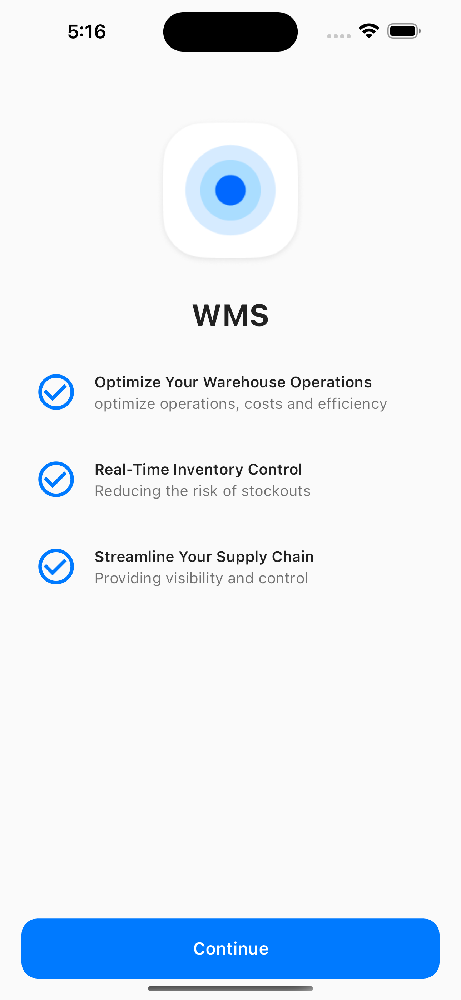
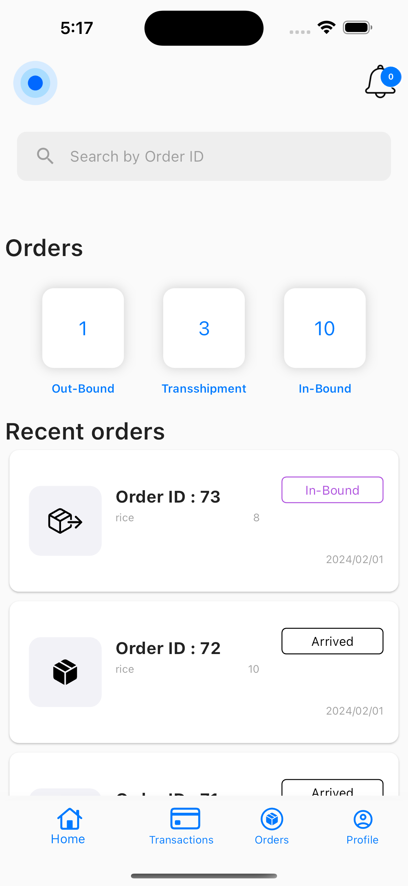
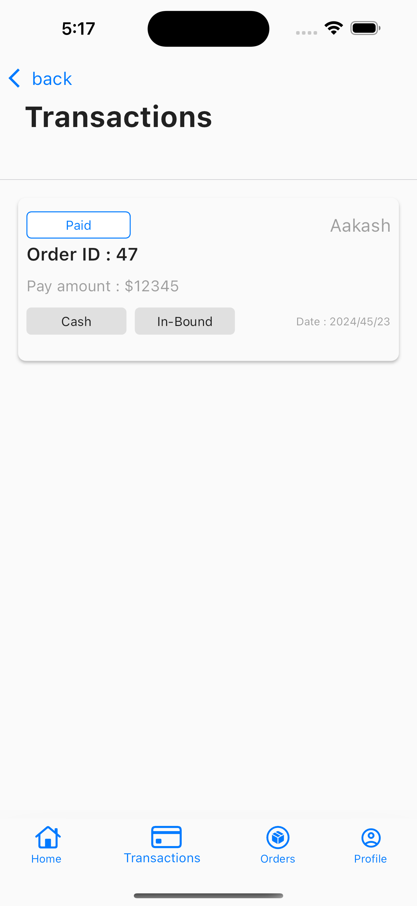
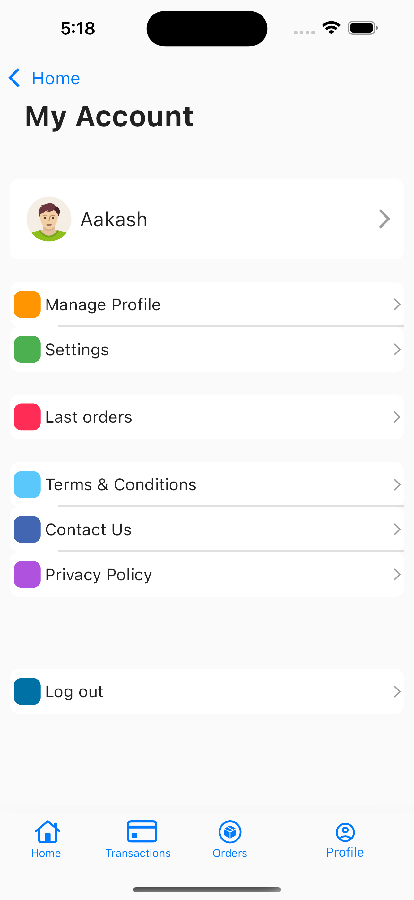
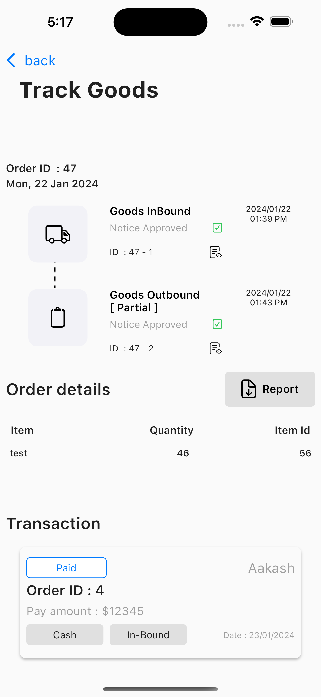
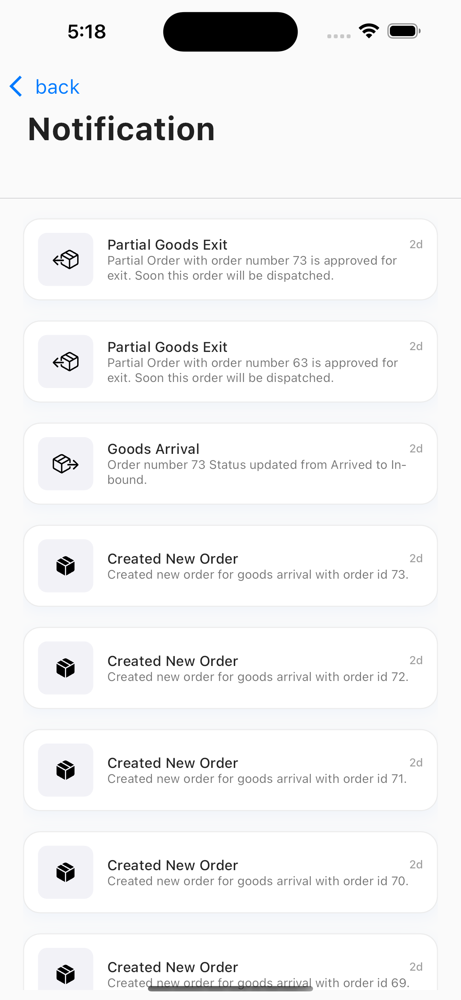

# WMS
Warehouse Management System 

## About
Proposed Project comprises of the design and development of a Warehouse Management System (WMS)- [Android & iOS] called Evelyne. There will be Five Actors involved in this project Users (Customers, Warehouses Manager, WMS Controller) and Admin.

- Controller : WMS Controller would be able to View all the Supply chain Movements & Transaction of all the Warehouses. [Authorized to View the Entries only, No Edit Permissions Allowed].WMS Controller would be able to view transactions in all the warehouses and can print the reports as per warehouse. WMS Controllers would be only atomized to view & Cannot Modify daily, monthly and yearly reports of the Warehouse. The WMS controller will have Access to all the Warehouses.

## Featuring Main Features

- Printing Reports
- Localization (French)
- Realtime Data 
- Calculating local currency
- Accept Edit Delete Orders 

## Screenshots

- End User : End User will be using WMS to View his/her Details of the Goods in the Warehouse & All Transactions & Order Status related to their Respective Order. End Users (Customers) can only see his/her goods and transactions for a particular warehouse.

  
  

## Features
### User End App :
- **1.** Users sign up with providing basic info like name, email,phone and Country.
- **2.** Forgot password feature with OTP validation. 
- **3.** Home Search bar for Orders  
- **4.** Notifications Screen and Indicator  
- **5.** Order details with Order Track History , Order Items , Arrival , Transhipment and Exit Notices downloads button
- **6.** Transaction status card
- **7.** My account sections 
- **8.** Localization(French)

- Manager  : Warehouse Manager would be able to view Status of all the Goods & Transactions taking place within his or her Respective Warehouse. Warehouse Manager would be responsible for the Validation of Goods Entry, Arrival Transshipment & Goods Exit. He can view and print daily. Monthly and yearly report. He must sign every Arrival notices, Exit notices and Transshipment notices together with the client after warehouse staff must have printed them. 
